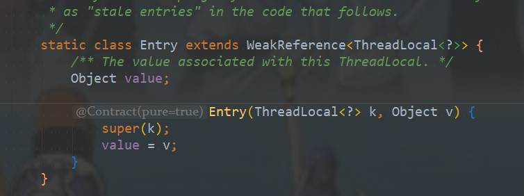
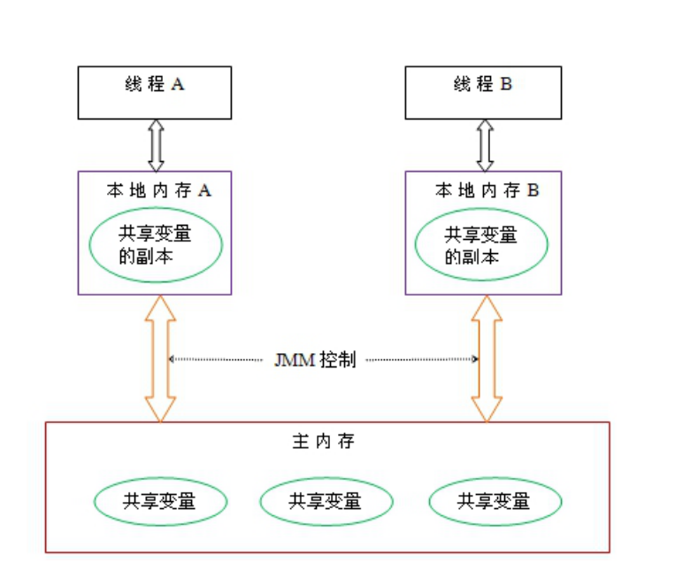

# 一、什么是线程安全问题

当多个线程同时共享，同一个**全局变量或静态变量**，做写的操作时，可能会发生数据冲突问题，也就是线程安全问题。但是做读操作是不会发生数据冲突问题。

# 二、线程安全问题的解决方法

线程同步或者加锁

**将可能会发生数据冲突问题(线程不安全问题)，只能让当前一个线程进行执行。代码执行完成后释放锁，让后才能让其他线程进行执行。这样的话就可以解决线程不安全问题。**

**当多个线程共享同一个资源,不会受到其他线程的干扰。** ——同步

# 三、synchronized内置锁

synchronized

同步代码块

同步方法

普通同步方法使用this锁

静态同步方法使用该方法字节码文件对象锁

synchronized 修饰方法使用锁是当前this锁。

synchronized 修饰静态方法使用锁是当前类的字节码文件

# 四、多线程死锁

同步中嵌套同步,导致锁无法释放

# 五、ThreadLocal

ThreadLocal是如何为每个线程创建变量的副本的：

　　首先，在每个线程Thread内部有一个ThreadLocal.ThreadLocalMap类型的成员变量threadLocals，这个threadLocals就是用来存储实际的变量副本的，键值为当前ThreadLocal变量，value为变量副本（即T类型的变量）。

　　初始时，在Thread里面，threadLocals为空，当通过ThreadLocal变量调用get()方法或者set()方法，就会对Thread类中的threadLocals进行初始化，并且以当前ThreadLocal变量为键值，以ThreadLocal要保存的副本变量为value，存到threadLocals。

　　然后在当前线程里面，如果要使用副本变量，就可以通过get方法在threadLocals里面查找。

ThreadLocal提高一个线程的局部变量，访问某个线程拥有自己局部变量。当使用ThreadLocal维护变量时，ThreadLocal为每个使用该变量的线程提供独立的变量副本，所以每一个线程都可以独立地改变自己的副本，而不会影响其它线程所对应的副本。

实现原理：

ThreadLocal通过map集合

Map.put(“当前线程”,值)；

ThreadLocal中解决冲突的策略是使用的线性探测法

ThreadLocalMap解决Hash冲突的方式就是简单的步长加1或减1，寻找下一个相邻的位置。处理hash冲突的效率低，**所以，每个线程只存一个变量，这样的话所有的线程存放到map中的Key都是相同的ThreadLocal，如果一个线程要保存多个变量，就需要创建多个ThreadLocal，多个ThreadLocal放入Map中时会极大的增加Hash冲突的可能。**

每个线程都有一个ThreadLoalMap

#### ThreadLocalMap的问题

由于ThreadLocalMap的key是弱引用，而Value是强引用。这就导致了一个问题，ThreadLocal在没有外部对象强引用时，发生GC时弱引用Key会被回收，而Value不会回收，如果创建ThreadLocal的线程一直持续运行，那么这个Entry对象中的value就有可能一直得不到回收，发生内存泄露。

**如何避免泄漏**
 既然Key是弱引用，那么我们要做的事，**就是在调用ThreadLocal的get()、set()方法时完成后再调用remove方法，将Entry节点和Map的引用关系移除**，这样整个Entry对象在GC Roots分析后就变成不可达了，下次GC的时候就可以被回收。

如果使用ThreadLocal的set方法之后，没有显示的调用remove方法，就有可能发生内存泄露，所以养成良好的编程习惯十分重要，**使用完ThreadLocal之后，记得调用remove方法**。

# 六、多线程的三大特性

## 6.1 原子性

即一个操作或者多个操作 要么全部执行并且执行的过程不会被任何因素打断，要么就都不执行。

## 6.2 可见性

当多个线程访问同一个变量时，一个线程修改了这个变量的值，其他线程能够立即看得到修改的值。

## 6.3 有序性

# 七、Java内存模型

共享内存模型指的就是Java内存模型(简称JMM)，**JMM决定一个线程对共享变量的写入时,能对另一个线程可见**。从抽象的角度来看，**JMM定义了线程和主内存之间的抽象关系**：线程之间的共享变量存储在主内存（main memory）中，每个线程都有一个私有的本地内存（local memory），本地内存中存储了该线程以读/写共享变量的副本。本地内存是JMM的一个抽象概念，并不真实存在。它涵盖了缓存，写缓冲区，寄存器以及其他的硬件和编译器优化。

Java内存模型简称JMM，定义了一个线程对另一个线程可见。共享变量存放在主内存中，每个线程都有自己的本地内存，当多个线程同时访问一个数据的时候，可能本地内存没有及时刷新到主内存，所以就会发生线程安全问题。

# 八、volatile

可见性也就是说一旦某个线程修改了该被volatile修饰的变量，它会保证修改的值会立即被更新到主存，当有其他线程需要读取时，可以立即获取修改之后的值。

在Java中为了加快程序的运行效率，对一些变量的操作通常是在该线程的寄存器或是CPU缓存上进行的，之后才会同步到主存中，而加了volatile修饰符的变量则是直接读写主存。

volatile 保证了线程间共享变量的及时可见性，但不能保证原子性

1.保证此变量对所有的线程的可见性，这里的“可见性”，当一个线程修改了这个变量的值，volatile 保证了新值能立即同步到主内存，以及每次使用前立即从主内存刷新。但普通变量做不到这点，普通变量的值在线程间传递均需要通过主内存（详见：Java内存模型）来完成。

 2.禁止指令重排序优化。有volatile修饰的变量，赋值后多执行了一个“load addl $0x0, (%esp)”操作，这个操作相当于一个内存屏障（指令重排序时不能把后面的指令重排序到内存屏障之前的位置），只有一个CPU访问内存时，并不需要内存屏障；（什么是指令重排序：是指CPU采用了允许将多条指令不按程序规定的顺序分开发送给各相应电路单元处理）。

 volatile 性能：

　　volatile 的读性能消耗与普通变量几乎相同，但是写操作稍慢，因为它需要在本地代码中插入许多内存屏障指令来保证处理器不发生乱序执行。

# 九、volatile与synchronized区别

（1）从而我们可以看出volatile虽然具有可见性但是并不能保证原子性。

（2）性能方面，synchronized关键字是防止多个线程同时执行一段代码，就会影响程序执行效率，而volatile关键字在某些情况下性能要优于synchronized。

但是要注意volatile关键字是无法替代synchronized关键字的，因为volatile关键字无法保证操作的原子性。