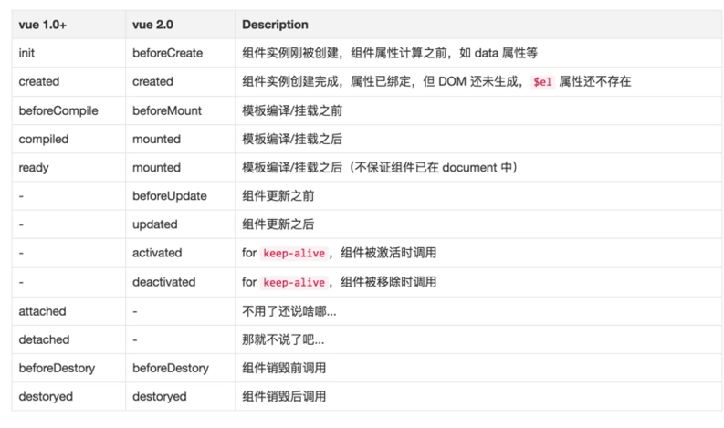

# 一、项目介绍

# 二、项目架构


# 三、技术描述

## 3.1 分布式架构

基于Spring Cloud开发，整个系统拆分成若干个子系统，各个系统之间都是通过Restful接口进行通信，方便今后功能的增加以及分布式部署。系统主要包含以下微服务：网关微服务、授权中心微服务、购物车微服务、评论微服务、配置中心微服务、页面详情微服务、后台管理微服务、订单微服务、注册中心微服务、搜索微服务、秒杀微服务、短信微服务、上传微服务、用户中心微服务。

## 3.2 分布式文件系统

FastDFS：文件存储、文件同步、文件访问（上传、下载）、存取负载均衡、在线扩容

FastDFS两个主要的角色：Tracker Server 和 Storage Server 。

- Tracker Server：跟踪服务器，主要负责调度storage节点与client通信，在访问上起负载均衡的作用，和记录storage节点的运行状态，是连接client和storage节点的枢纽。 
- Storage Server：存储服务器，保存文件和文件的meta data（元数据），每个storage server会启动一个单独的线程主动向Tracker cluster中每个tracker server报告其状态信息，包括磁盘使用情况，文件同步情况及文件上传下载次数统计等信息
- Group：文件组，多台Storage Server的集群。上传一个文件到同组内的一台机器上后，FastDFS会将该文件即时同步到同组内的其它所有机器上，起到备份的作用。不同组的服务器，保存的数据不同，而且相互独立，不进行通信。 
- Tracker Cluster：跟踪服务器的集群，有一组Tracker Server（跟踪服务器）组成。
- Storage Cluster ：存储集群，有多个Group组成。

**上边介绍的NFS、GFS都是通用的分布式文件系统，通用的分布式文件系统的优点的是开发体验好，但是系统复杂性高、性能一般，而专用的分布式文件系统虽然开发体验性差，但是系统复杂性低并且性能高。fastDFS非常适合存储图片等那些小文件，fastDFS不对文件进行分块，所以它就没有分块合并的开销，fastDFS网络通信采用socket，通信速度很快。**

### 3.2.1 上传流程

1. Client通过Tracker server查找可用的Storage server。
2. Tracker server向Client返回一台可用的Storage server的IP地址和端口号。
3. Client直接通过Tracker server返回的IP地址和端口与其中一台Storage server建立连接并进行文件上传。
4. 上传完成，Storage server返回Client一个文件ID，文件上传结束。

### 3.2.2 下载流程

1. Client通过Tracker server查找要下载文件所在的的Storage server。
2. Tracker server向Client返回包含指定文件的某个Storage server的IP地址和端口号。
3. Client直接通过Tracker server返回的IP地址和端口与其中一台Storage server建立连接并指定要下载文件。
4. 下载文件成功。

## 3.3 Redis

本项目用到redis的地方：购物车、秒杀、页面静态化、用户认证、短信验证码。

### 3.3.1 购物车

因为购物车是一个读写频率很高的数据。因此这里 选择读写效率比较高的Redis作为购物车存储。

Redis有5种不同数据结构，这里选择哪一种比较合适呢？

- 首先不同用户应该有独立的购物车，因此购物车应该以用户的作为key来存储，Value是用户的所有购物车信息。这样看来基本的`k-v`结构就可以了。
- 但是，我们对购物车中的商品进行增、删、改操作，基本都需要根据商品id进行判断，为了方便后期处理，我们的购物车也应该是`k-v`结构，key是商品id，value才是这个商品的购物车信息。

综上所述，我们的购物车结构是一个双层Map：Map<String,Map<String,String>>

- 第一层Map，Key是用户id
- 第二层Map，Key是购物车中商品id，值是购物车数据

最后采用： BoundHashOperations

### 3.3.2 秒杀

主要是用来存放可供秒杀的商品库存，以及秒杀地址

### 3.3.3 页面缓存

将不经常改动的页面直接放到redis中，然后用Thymeleaf视图解析器将缓存的页面进行渲染。

### 3.3.4 用户认证

因为用户登录认证经常使用，所以将用户信息存入redis中，先去redis中查询用户，查不到的话再去数据库中查

### 3.3.5 短信验证码

将生成的短信验证码保存在redis中，并且设置过期时间

### 3.3.6 Redis相关知识

> **Redis的数据类型**

Redis支持五种数据类型：string（字符串），hash（哈希），list（列表），set（集合）及zset(sorted set：有序集合)。 


> **Redis的特点**

1.单线程，利用redis队列技术并将访问变为串行访问，消除了传统数据库串行控制的开销

2.redis具有快速和持久化的特征，速度快，因为数据存在内存中。

3.分布式 读写分离模式

4.支持丰富数据类型

5.**支持事务，操作都是原子性**，所谓原子性就是对数据的更改要么全部执行，要不全部不执行。

6.可用于缓存，消息，按key设置过期时间，过期后自动删除

> **Spring Data Redis**

ValueOperations：简单K-V操作 

SetOperations：set类型数据操作 

ZSetOperations：zset类型数据操作 

HashOperations：针对map类型的数据操作 

ListOperations：针对list类型的数据操作 

```java
redisTemplate.opsForValue();//操作字符串
redisTemplate.opsForHash();//操作hash
redisTemplate.opsForList();//操作list
redisTemplate.opsForSet();//操作set
redisTemplate.opsForZSet();//操作有序set

stringRedisTemplate.opsForValue();
stringRedisTemplate.opsForHash();
stringRedisTemplate.opsForList();
stringRedisTemplate.opsForSet();
stringRedisTemplate.opsForZSet();
```

**他们两者之间的区别主要在于他们使用的序列化类。** 

- RedisTemplate使用的是 JdkSerializationRedisSerializer
- StringRedisTemplate使用的是 StringRedisSerializer

提供了对key的“bound”(绑定)便捷化操作API，可以通过bound封装指定的key，然后进行一系列的操作而无须“显式”的再次指定Key，即BoundKeyOperations： 

BoundValueOperations 

BoundSetOperations 

BoundListOperations 

BoundSetOperations 

BoundHashOperations 

例子：

```java
 BoundHashOperations<String,Object,Object> hashOperations = this.stringRedisTemplate.boundHashOps(key);
```

## 3.4 Elasticsearch

商品搜索

### 3.4.1 基本概念

索引（indices）--------------------------------Databases 数据库

​	类型（type）-----------------------------Table 数据表

​	     文档（Document）----------------Row 行

​		   字段（Field）-------------------Columns 列 

| 概念                 | 说明                                                         |
| -------------------- | ------------------------------------------------------------ |
| 索引库（indices)     | indices是index的复数，代表许多的索引，                       |
| 类型（type）         | 类型是模拟mysql中的table概念，一个索引库下可以有不同类型的索引，比如商品索引，订单索引，其数据格式不同。不过这会导致索引库混乱，因此未来版本中会移除这个概念 |
| 文档（document）     | 存入索引库原始的数据。比如每一条商品信息，就是一个文档       |
| 字段（field）        | 文档中的属性                                                 |
| 映射配置（mappings） | 字段的数据类型、属性、是否索引、是否存储等特性               |

要注意的是：Elasticsearch本身就是分布式的，因此即便你只有一个节点，Elasticsearch默认也会对你的数据进行分片和副本操作，当你向集群添加新数据时，数据也会在新加入的节点中进行平衡。

### 3.4.2 创建索引


settings：索引库的设置

- number_of_shards：分片数量
- number_of_replicas：副本数量

### 3.4.3 查看索引

GET /索引库名

### 3.4.4 删除索引

DELETE /索引库名

### 3.4.5 映射配置

```
PUT /索引库名/_mapping/类型名称
{
  "properties": {
    "字段名": {
      "type": "类型",
      "index": true，
      "store": true，
      "analyzer": "分词器"
    }
  }
}
```

- 类型名称：就是前面将的type的概念，类似于数据库中的不同表
  字段名：任意填写	，可以指定许多属性，例如：
- type：类型，可以是text、long、short、date、integer、object等
- index：是否索引，默认为true
- store：是否存储，默认为false
- analyzer：分词器，这里的`ik_max_word`即使用ik分词器

### 3.4.6 新增数据

```
POST /索引库名/类型名
{
    "key":"value"
}
```

### 3.4.7 修改数据

新增方式改为PUT即可

### 3.4.8 删除数据

```
DELETE /索引库名/类型名/id值
```

## 3.5 RabbitMQ

项目中使用RabbitMQ的地方是数据同步、秒杀中使用

### 3.5.1 数据同步

当后台管理修改完商品信息后，前台页面搜索结果要相应的改变，因为搜索数据是放在Elasticsearch中的，所以要更新索引库。

### 3.5.2 秒杀

用户预减库存成功，那么将该用户的信息发生到RabbitMQ中，然后订单微服务监听到后再创建订单。

### 3.5.3 RabbitMQ基础知识

**消息类型**

五种消息类型：基本消息，work消息、订阅模型(Fanout)、订阅模型(Direct)，订阅模型(Topic)。

<1>基本消息模型


<2>work消息模型


<3>订阅模型(Fanout、Direct、Topic)


1、1个生产者，多个消费者

2、每一个消费者都有自己的一个队列

3、生产者没有将消息直接发送到队列，而是发送到了交换机

4、每个队列都要绑定到交换机

5、生产者发送的消息，经过交换机到达队列，实现一个消息被多个消费者获取的目的

X（Exchanges）：交换机一方面：接收生产者发送的消息。另一方面：知道如何处理消息，例如递交给某个特别队列、递交给所有队列、或是将消息丢弃。到底如何操作，取决于Exchange的类型。

Exchange类型有以下几种：

 Fanout：广播，将消息交给所有绑定到交换机的队列

 Direct：定向，把消息交给符合指定routing key 的队列

 Topic：通配符，把消息交给符合routing pattern（路由模式） 的队列

Exchange（交换机）只负责转发消息，不具备存储消息的能力，因此如果没有任何队列与Exchange绑定，或者没有符合路由规则的队列，那么消息会丢失！

## 3.6 Nginx

反向代理

## 3.7 秒杀方案

- 秒杀地址隐藏
- 秒杀前先验证路径是否正确
- 接口限流：用户在某一段时间内有限次的访问创建秒杀地址的接口。（**将用户访问地址的次数写入redis当中，同时设置过期时间。当用户每次访问，该值就加一，当访问次数超出限定数值时，那么就直接返回** ）
- 秒杀库存预减，用户先去redis中对库存进行预减，预减成功就将用户信息发送到消息队列中；当redis中库存不足时，设置内存标记为true，以减少对redis的访问。
- 订单微服务监听消息队列中的信息（topic）,拿到用户信息后就创建订单，减库存等操作。

## 3.8 配置集中管理

使用Spring Cloud Config对所有微服务的配置进行集中管理。

## 3.9 分布式自增id

雪花算法会生成一个64位的二进制数据，为一个Long型。(转换成字符串后长度最多19位) ，其基本结构： 


第一位：未使用

第二部分：41位为毫秒级时间(41位的长度可以使用69年)

第三部分：5位datacenterId和5位workerId(10位的长度最多支持部署1024个节点）

第四部分：最后12位是毫秒内的计数（12位的计数顺序号支持每个节点每毫秒产生4096个ID序号）

snowflake生成的ID整体上按照时间自增排序，并且整个分布式系统内不会产生ID碰撞（由datacenter和workerId作区分），并且效率较高。经测试snowflake每秒能够产生26万个ID。

## 3.10 JWT无状态登录

Json Web Token

JWT包含三部分数据：

- Header：头部，通常头部有两部分信息：

  - 声明类型，这里是JWT
  - 加密算法，自定义

  我们会对头部进行base64加密（可解密），得到第一部分数据

- Payload：载荷，就是有效数据，一般包含下面信息：

  - 用户身份信息（注意，这里因为采用base64加密，可解密，因此不要存放敏感信息）
  - 注册声明：如token的签发时间，过期时间，签发人等

  这部分也会采用base64加密，得到第二部分数据

- Signature：签名，是整个数据的认证信息。一般根据前两步的数据，再加上服务的的密钥（secret）（不要泄漏，最好周期性更换），通过加密算法生成。用于验证整个数据完整和可靠性

**解决Cookie写入问题**

跨域请求cookie生效的条件：

- 服务的响应头中需要携带Access-Control-Allow-Credentials并且为true。
- 响应头中的Access-Control-Allow-Origin一定不能为*，必须是指定的域名
- 浏览器发起ajax需要指定withCredentials 为true

**解决host地址变化**

那么问题来了：为什么我们这里的请求serverName变成了：127.0.0.1:8087呢？

这里的server name其实就是请求时的主机名：Host，之所以改变，有两个原因：

- 我们使用了nginx反向代理，当监听到api.leyou.com的时候，会自动将请求转发至127.0.0.1:10010，即Zuul。
- 而后请求到达我们的网关Zuul，Zuul就会根据路径匹配，我们的请求是/api/auth，根据规则被转发到了 127.0.0.1:8087 ，即我们的授权中心。

我们首先去更改nginx配置，让它不要修改我们的host：`proxy_set_header Host $host;`

**配置网关**

携带请求本身的head头信息  add-host-header:true

**Zuul的敏感头过滤**


## 3.11 跨域问题的解决

跨域是指跨域名的访问，以下情况都属于跨域：

| 跨域原因说明       | 示例                                   |
| ------------------ | -------------------------------------- |
| 域名不同           | `www.jd.com` 与 `www.taobao.com`       |
| 域名相同，端口不同 | `www.jd.com:8080` 与 `www.jd.com:8081` |
| 二级域名不同       | `item.jd.com` 与 `miaosha.jd.com`      |

CORS解决跨域


浏览器会将ajax请求分为两类，其处理方案略有差异：简单请求、特殊请求。

#### 简单请求

只要同时满足以下两大条件，就属于简单请求。：

（1) 请求方法是以下三种方法之一：

- HEAD
- GET
- POST

（2）HTTP的头信息不超出以下几种字段：

- Accept
- Accept-Language
- Content-Language
- Last-Event-ID
- Content-Type：只限于三个值`application/x-www-form-urlencoded`、`multipart/form-data`、`text/plain`

当浏览器发现的ajax请求是简单请求时，会在请求头中携带一个字段：`Origin`.

Origin中会指出当前请求属于哪个域（协议+域名+端口）。服务会根据这个值决定是否允许其跨域。

如果服务器允许跨域，需要在返回的响应头中携带下面信息：

```http
Access-Control-Allow-Origin: http://manage.leyou.com
Access-Control-Allow-Credentials: true
Content-Type: text/html; charset=utf-8
```

- Access-Control-Allow-Origin：可接受的域，是一个具体域名或者*，代表任意
- Access-Control-Allow-Credentials：是否允许携带cookie，默认情况下，cors不会携带cookie，除非这个值是true

注意：

如果跨域请求要想操作cookie，需要满足3个条件：

- 服务的响应头中需要携带Access-Control-Allow-Credentials并且为true。
- 浏览器发起ajax需要指定withCredentials 为true
- 响应头中的Access-Control-Allow-Origin一定不能为*，必须是指定的域名

#### 特殊请求

不符合简单请求的条件，会被浏览器判定为特殊请求,，例如请求方式为PUT。

> 预检请求

特殊请求会在正式通信之前，增加一次HTTP查询请求，称为"预检"请求（preflight）。

浏览器先询问服务器，当前网页所在的域名是否在服务器的许可名单之中，以及可以使用哪些HTTP动词和头信息字段。只有得到肯定答复，浏览器才会发出正式的`XMLHttpRequest`请求，否则就报错。

一个“预检”请求的样板：

```http
OPTIONS /cors HTTP/1.1
Origin: http://manage.leyou.com
Access-Control-Request-Method: PUT
Access-Control-Request-Headers: X-Custom-Header
Host: api.leyou.com
Accept-Language: en-US
Connection: keep-alive
User-Agent: Mozilla/5.0...
```

与简单请求相比，除了Origin以外，多了两个头：

- Access-Control-Request-Method：接下来会用到的请求方式，比如PUT
- Access-Control-Request-Headers：会额外用到的头信息

> 预检请求的响应

服务的收到预检请求，如果许可跨域，会发出响应：

```http
HTTP/1.1 200 OK
Date: Mon, 01 Dec 2008 01:15:39 GMT
Server: Apache/2.0.61 (Unix)
Access-Control-Allow-Origin: http://manage.leyou.com
Access-Control-Allow-Credentials: true
Access-Control-Allow-Methods: GET, POST, PUT
Access-Control-Allow-Headers: X-Custom-Header
Access-Control-Max-Age: 1728000
Content-Type: text/html; charset=utf-8
Content-Encoding: gzip
Content-Length: 0
Keep-Alive: timeout=2, max=100
Connection: Keep-Alive
Content-Type: text/plain
```

除了`Access-Control-Allow-Origin`和`Access-Control-Allow-Credentials`以外，这里又额外多出3个头：

- Access-Control-Allow-Methods：允许访问的方式
- Access-Control-Allow-Headers：允许携带的头
- Access-Control-Max-Age：本次许可的有效时长，单位是秒，**过期之前的ajax请求就无需再次进行预检了**


如果浏览器得到上述响应，则认定为可以跨域，后续就跟简单请求的处理是一样的了。

CORS的跨域过滤器：CorsFilter :

```java
import org.springframework.context.annotation.Bean;
import org.springframework.context.annotation.Configuration;
import org.springframework.web.cors.CorsConfiguration;
import org.springframework.web.cors.UrlBasedCorsConfigurationSource;
import org.springframework.web.filter.CorsFilter;

@Configuration
public class GlobalCorsConfig {
    @Bean
    public CorsFilter corsFilter() {
        //1.添加CORS配置信息
        CorsConfiguration config = new CorsConfiguration();
        //1) 允许的域,不要写*，否则cookie就无法使用了
        config.addAllowedOrigin("http://manage.leyou.com");
        //2) 是否发送Cookie信息
        config.setAllowCredentials(true);
        //3) 允许的请求方式
        config.addAllowedMethod("OPTIONS");
        config.addAllowedMethod("HEAD");
        config.addAllowedMethod("GET");
        config.addAllowedMethod("PUT");
        config.addAllowedMethod("POST");
        config.addAllowedMethod("DELETE");
        config.addAllowedMethod("PATCH");
        // 4）允许的头信息
        config.addAllowedHeader("*");

        //2.添加映射路径，我们拦截一切请求
        UrlBasedCorsConfigurationSource configSource = new UrlBasedCorsConfigurationSource();
        configSource.registerCorsConfiguration("/**", config);

        //3.返回新的CorsFilter.
        return new CorsFilter(configSource);
    }
}
```

## 3.12 延时队列

通过RabbitMQ实现延时队列

但是可以根据其特性Per-Queue Message TTL和 Dead Letter Exchanges实现延时队列 

RabbitMQ可以针对消息和队列设置TTL（过期时间） 


# 四、前端

## 4.1 Vue的生命周期


```html
<!DOCTYPE html>
<html>
<head>
    <title></title>
    <script type="text/javascript" src="https://cdn.jsdelivr.net/vue/2.1.3/vue.js"></script>
</head>
<body>

<div id="app">
     <p>{{ message }}</p>
</div>

<script type="text/javascript">
    
  var app = new Vue({
      el: '#app',
      data: {
          message : "xuxiao is boy" 
      },
       beforeCreate: function () {
                console.group('beforeCreate 创建前状态===============》');
               console.log("%c%s", "color:red" , "el     : " + this.$el); //undefined
               console.log("%c%s", "color:red","data   : " + this.$data); //undefined 
               console.log("%c%s", "color:red","message: " + this.message)  
        },
        created: function () {
            console.group('created 创建完毕状态===============》');
            console.log("%c%s", "color:red","el     : " + this.$el); //undefined
               console.log("%c%s", "color:red","data   : " + this.$data); //已被初始化 
               console.log("%c%s", "color:red","message: " + this.message); //已被初始化
        },
        beforeMount: function () {
            console.group('beforeMount 挂载前状态===============》');
            console.log("%c%s", "color:red","el     : " + (this.$el)); //已被初始化
            console.log(this.$el);
               console.log("%c%s", "color:red","data   : " + this.$data); //已被初始化  
               console.log("%c%s", "color:red","message: " + this.message); //已被初始化  
        },
        mounted: function () {
            console.group('mounted 挂载结束状态===============》');
            console.log("%c%s", "color:red","el     : " + this.$el); //已被初始化
            console.log(this.$el);    
               console.log("%c%s", "color:red","data   : " + this.$data); //已被初始化
               console.log("%c%s", "color:red","message: " + this.message); //已被初始化 
        },
        beforeUpdate: function () {
            console.group('beforeUpdate 更新前状态===============》');
            console.log("%c%s", "color:red","el     : " + this.$el);
            console.log(this.$el);   
               console.log("%c%s", "color:red","data   : " + this.$data); 
               console.log("%c%s", "color:red","message: " + this.message); 
        },
        updated: function () {
            console.group('updated 更新完成状态===============》');
            console.log("%c%s", "color:red","el     : " + this.$el);
            console.log(this.$el); 
               console.log("%c%s", "color:red","data   : " + this.$data); 
               console.log("%c%s", "color:red","message: " + this.message); 
        },
        beforeDestroy: function () {
            console.group('beforeDestroy 销毁前状态===============》');
            console.log("%c%s", "color:red","el     : " + this.$el);
            console.log(this.$el);    
               console.log("%c%s", "color:red","data   : " + this.$data); 
               console.log("%c%s", "color:red","message: " + this.message); 
        },
        destroyed: function () {
            console.group('destroyed 销毁完成状态===============》');
            console.log("%c%s", "color:red","el     : " + this.$el);
            console.log(this.$el);  
               console.log("%c%s", "color:red","data   : " + this.$data); 
               console.log("%c%s", "color:red","message: " + this.message)
        }
    })
</script>
</body>
</html>
```



## 4.2 处理前端精度丢失

这其实是因为JS的长整数精度有限，java的Long类型数据超出了范围，所以出现了精度损失。

我们后台返回的是Json的字符串，在axios内部会自动调用 JSON.parse()方法把json字符串转为JS数据，就会出现进度损失。如果不进行转换，依然当做字符串来使用，就不会有问题了。

因此，我们重写axios对响应的处理回调函数：

